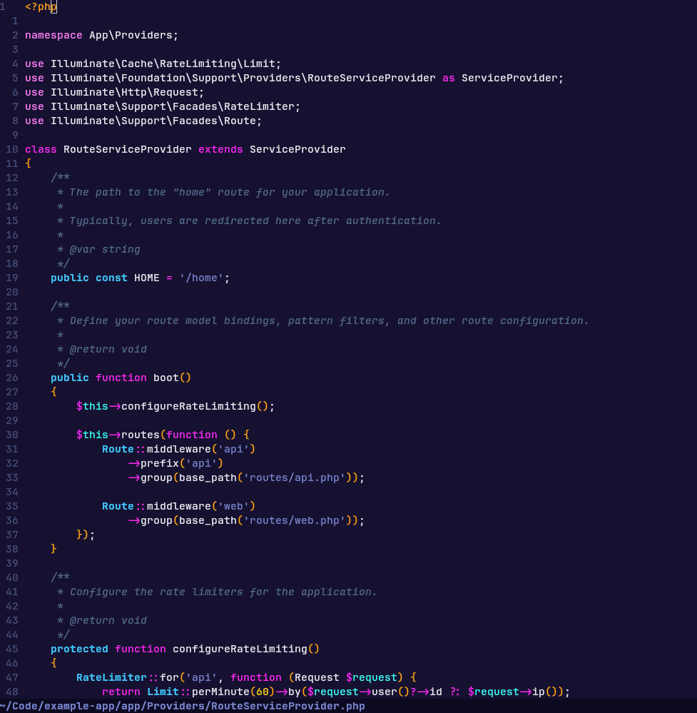

# Outrun Night

A dark Neovim theme written in Lua and ported from the Visual Studio Code [Outrun Theme](https://github.com/samrap/outrun-theme-vscode).

The theme is "inspired by the colors, style, and culture of the synthwave music scene."



## Installation

[Packer](https://github.com/wbthomason/packer.nvim) and Lua:

``` lua
-- Install and enable theme
use({
  'paulmaxwell/outrun-night.nvim',
  config = function()
    vim.cmd('colorscheme outrun-night')
  end,
})
```

## Contributing

Pull requests are welcome.
